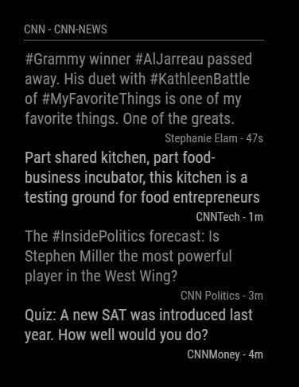

# Module: Tweets By Timeline Or List
The `MMM-TweetsByTimelineOrList` module is a module designed to display tweets from a user's home timeline, from a list or from the results of an HashTag search. The tweets show can be configured in a variety of ways and are shown in a slideshow like fashion, showing just a few and then rotating into the next set.

Example:

 

## Dependencies / Requirements

This module requires the use of the `twitter` and `bad-words` packages for node.js. To install them, please run:

```
npm install twitter
npm install bad-words
```

from the `MMM-TweetsByTimelineOrList` module directory inside your Magic Mirror installation directory.

This module also requires Twitter access tokens and keys. For more information on acquiring these please visit <https://dev.twitter.com/oauth/overview/application-owner-access-tokens>.

## Operation

This module displays a number of tweets at time in a row by row fashion with the tweet's full username and age of the tweet also being display. Tweets are set in alternating gray-level colors to distinguish them.

Tweets that are displayed have all links, media, quotes, and emojis stripped from them. This is done to simplify the display to simple text only. 

The choice of displayed tweets can either be a user's timeline, a user's list or the results of an HashTag search (i.e. #twitter). By default the timeline will show the timeline for the user for whom the API access keys will generated. Setting the username in the config will confirm the user.

There are many configuration options controlling which, how many, how often, etc, tweets are shown and used, so please read through those that are available.

## Using the module

To use this module, add it to the modules array in the `config/config.js` file:
````javascript
modules: [
	{
		module: 'MMM-TweetsByTimelineOrList',
		position: 'bottom_left',
		config: {
		// visit the url below for the twitter keys/tokens
		// https://dev.twitter.com/oauth/overview/application-owner-access-tokens
			consumer_key: 'FILL IN',
			consumer_secret: 'FILL IN',
			access_token_key: 'FILL IN',
			access_token_secret: 'FILL IN',
		// set the username and either timeline or listname or search
		// for search, enter the hashtag without the # into the screenname field i.e. screenName: 'twitter',
	        screenName: 'someusername',
	        listToShow: 'TIMELINE',
		}
	}	
]
````

## Configuration options

The following properties can be configured:

<table width="100%">
	<!-- why, markdown... -->
	<thead>
		<tr>
			<th>Option</th>
			<th width="100%">Description</th>
		</tr>
	<thead>
	<tbody>
		<tr>
			<td><code>consumer_key</code></td>
			<td>Used by the Twitter package in order to collect the trends. For more visit <a href="https://dev.twitter.com/oauth/overview/application-owner-access-tokens">https://dev.twitter.com/oauth/overview/application-owner-access-tokens</a>.<br>
			<br>This value is <b>REQUIRED</b>
			</td>
		</tr>
		<tr>
			<td><code>consumer_secret</code></td>
			<td>Used by the Twitter package in order to collect the trends. For more visit <a href="https://dev.twitter.com/oauth/overview/application-owner-access-tokens">https://dev.twitter.com/oauth/overview/application-owner-access-tokens</a>.<br>
			<br>This value is <b>REQUIRED</b>
			</td>
		</tr>
		<tr>
			<td><code>access_token_key</code></td>
			<td>Used by the Twitter package in order to collect the trends. For more visit <a href="https://dev.twitter.com/oauth/overview/application-owner-access-tokens">https://dev.twitter.com/oauth/overview/application-owner-access-tokens</a>.<br>
			<br>This value is <b>REQUIRED</b>
			</td>
		</tr>
		<tr>
			<td><code>access_token_secret</code></td>
			<td>Used by the Twitter package in order to collect the trends. For more visit <a href="https://dev.twitter.com/oauth/overview/application-owner-access-tokens">https://dev.twitter.com/oauth/overview/application-owner-access-tokens</a>.<br>
			<br>This value is <b>REQUIRED</b>
			</td>
		</tr>			
		<tr>
			<td><code>screenName</code></td>
			<td>Should be set to either a) your username if you want to show your TIMELINE or one of your user lists, b) another username if accessing one of their user lists or c) the HashTag (exclude the #) that you want to search for (i.e twitter)<br>
			<br>This value is <b>REQUIRED</b>
			</td>
		</tr>	
		<tr>
			<td><code>listToShow</code></td>
			<td>Should be set to either a) 'TIMELINE', if you want to show your timeline, b) 'LISTNAME', the stub name of one of your user lists or another user's user lists or c) 'SEARCH' to carry out a HashTag search on all recent posts. This is configured tightly with the above <code>screenName</code> configuratoin option so set accordingly.<br>
			<br>This value is <b>REQUIRED</b>
			</td>
		</tr>	
		<tr>
			<td><code>tweetsToShowAtATime</code></td>
			<td>The number of tweets to display on screen at a time.<br>
				<br><b>Example:</b> <code>7</code>
				<br><b>Default value:</b> <code>5</code>
				<br>This value is <b>OPTIONAL</b>
			</td>
		</tr>		
		<tr>
			<td><code>onScreenRefreshRate</code></td>
			<td>The delay between changing the on-screen displayed tweets for the next set. In milliseconds.<br>
				<br><b>Example:</b> <code>15000</code>
				<br><b>Default value:</b> <code>25000</code>
				<br>This value is <b>OPTIONAL</b>
			</td>
		</tr>		
		<tr>
			<td><code>tweetUpdateRefreshRate</code></td>
			<td>How often to fetch a new set of tweets. In milliseconds. Should not be done more than once every few minutes since the on-screen refresh will delay the need for constant new tweets.<br>
				<br><b>Example:</b> <code>180000</code>
				<br><b>Default value:</b> <code>300000</code> (5 minutes)
				<br>This value is <b>OPTIONAL</b>
			</td>
		</tr>		
		<tr>
			<td><code>moduleWidth</code></td>
			<td>The width of the module specified via CSS widths, usually in 'px' pixels.<br>
				<br><b>Example:</b> <code>'250px'</code>
				<br><b>Default value:</b> <code>'300px'</code>
				<br>This value is <b>OPTIONAL</b>
			</td>
		</tr>						
		<tr>
			<td><code>animationSpeed</code></td>
			<td>The animation speed sent to updateDom to fade in between new sets of on-screen tweets.<br>
				<br><b>Example:</b> <code>4500</code>
				<br><b>Default value:</b> <code>3000</code>
				<br>This value is <b>OPTIONAL</b>
			</td>
		</tr>		
		<tr>
			<td><code>showHeader</code></td>
			<td>Boolean that sets if a header should be shown or not. When enabled show's username and use of timeline or list name.<br>
				<br><b>Example:</b> <code>true</code>
				<br><b>Default value:</b> <code>false</code>
				<br>This value is <b>OPTIONAL</b>
			</td>
		</tr>		
		<tr>
			<td><code>totalTweetsPerUpdate</code></td>
			<td>The number of tweets max to get in any given update. Does equal the number of tweets that will finally qualify for displaying, so should be larger. Should not be changed in most cases.<br>
				<br><b>Example:</b> <code>100</code>
				<br><b>Default value:</b> <code>1500</code>
				<br>This value is <b>OPTIONAL</b>
			</td>
		</tr>		
		<tr>
			<td><code>excludeTweetsWithQuotes</code></td>
			<td>Boolean the determines if tweets that have another quote in them should excluded from display.<br>
				<br><b>Example:</b> <code>false</code>
				<br><b>Default value:</b> <code>true</code>
				<br>This value is <b>OPTIONAL</b>
			</td>
		</tr>		
		<tr>
			<td><code>excludeRetweets</code></td>
			<td>Boolean the determines if tweets that are re-tweeted should be excluded from display.<br>
				<br><b>Example:</b> <code>false</code>
				<br><b>Default value:</b> <code>true</code>
				<br>This value is <b>OPTIONAL</b>
			</td>
		</tr>			
		<tr>
			<td><code>excludeMediaTweets</code></td>
			<td>Boolean the determines if tweets that have media (i.e. image or video) should excluded from display.<br>
				<br><b>Example:</b> <code>true</code>
				<br><b>Default value:</b> <code>false</code>
				<br>This value is <b>OPTIONAL</b>
			</td>
		</tr>			
		<tr>
			<td><code>excludeLinkTweets</code></td>
			<td>Boolean the determines if tweets that have a link should excluded from display.<br>
				<br><b>Example:</b> <code>true</code>
				<br><b>Default value:</b> <code>false</code>
				<br>This value is <b>OPTIONAL</b>
			</td>
		</tr>			
		<tr>
			<td><code>excludeTweetLengthLessThan</code></td>
			<td>Tweets with less than this number of characters will be excluded from display.<br>
				<br><b>Example:</b> <code>20</code>
				<br><b>Default value:</b> <code>16</code>
				<br>This value is <b>OPTIONAL</b>
			</td>
		</tr>	
		<tr>
			<td><code>excludeTweetsWithoutText</code></td>
			<td>This is an array of strings that are checked against a given tweet. If a tweet includes any of the strings in the array than it would be included, otherwise it is excluded. If an empty array is specified than no checking of this kind will occur at all. NOTE: This compairison is made case insensitive.<br>
				<br><b>Example:</b> <code>[ 'elephants', 'deer' ]</code>
				<br><b>Default value:</b> <code>[ ]</code>
				<br>This value is <b>OPTIONAL</b>
			</td>
		</tr>	
		<tr>
			<td><code>maxTweetsPerUser</code></td>
			<td>Limits the number of tweets any one user can have dispalyed, preventing one user from taking up many many of the displayed tweets. If set to zero, no limiting will occur at all.<br>
				<br><b>Example:</b> <code>4</code>
				<br><b>Default value:</b> <code>1</code>
				<br>This value is <b>OPTIONAL</b>
			</td>
		</tr>	
		<tr>
			<td><code>maxTweetAgeMins</code></td>
			<td>Tweets greater than this value specified in minutes will be excluded from display. If set to zero no age limit will be set.<br>
				<br><b>Example:</b> <code>120</code>
				<br><b>Default value:</b> <code>360</code> (6 hours)
				<br>This value is <b>OPTIONAL</b>
			</td>
		</tr>
		<tr>
			<td><code>allowSpecialCharacters</code></td>
			<td>Determines if non-alphanumerics will be allowed in the display string or not. If set to true Unicode characters that are outside regular English will be allowed in, characters that feature an Umlaute over them for instance. These are typically found in non-English languages, like German. This also may allow in unwanted characters however, like those that are featured as part of an emoji. The code currently does not discriminate here. For most English users this value should remain false.<br>
				<br><b>Example:</b> <code>true</code>
				<br><b>Default value:</b> <code>false</code>
				<br>This value is <b>OPTIONAL</b>
			</td>
		</tr>
		<tr>
			<td><code>displayColors</code></td>
			<td>A list of strings, where each string is a color in the '#RGB' format. The displayed tweets will be displayed in order of the colors listed, cycling through them as needed based on the number of tweets shown.<br>
				<br><b>Example:</b> <code>[ '#e00', '#0e0', '#00e']</code>
				<br><b>Default value:</b> <code>[ '#888', '#aaa', ]</code> (darker grey, lighter grey)
				<br>This value is <b>OPTIONAL</b>
			</td>
		</tr>		
		<tr>
			<td><code>filterBadWords</code></td>
			<td>Defaults to `false`.  When set to `true`, objectionable words are replaced with asterisks for a more child-friendly display.</td>
		</tr>
	</tbody>
</table>
